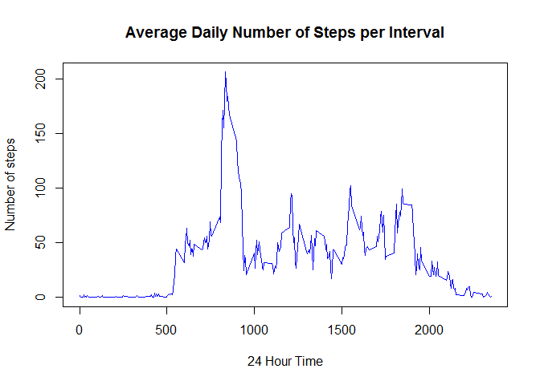
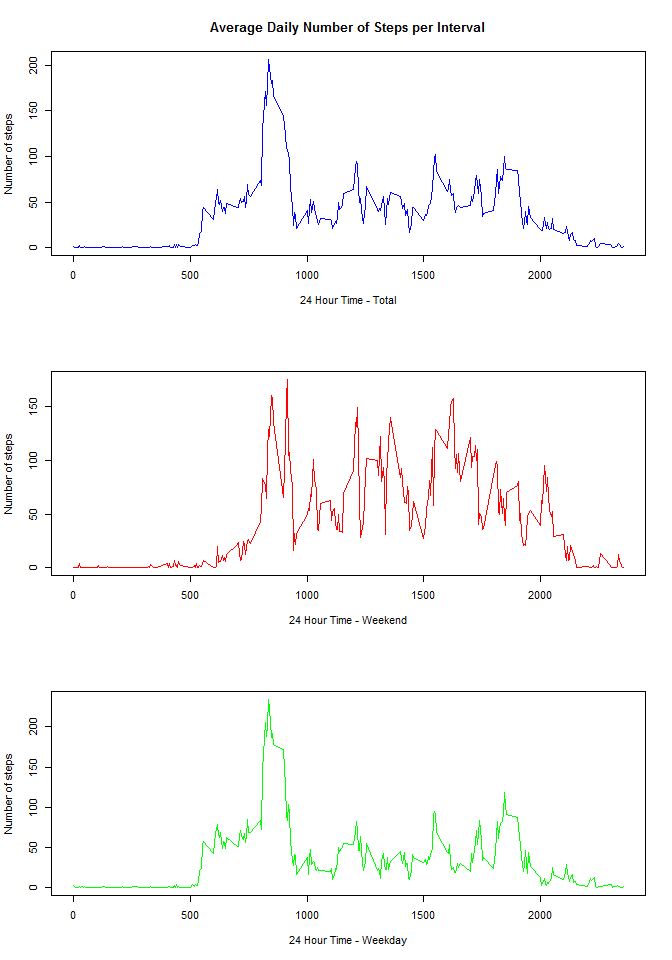
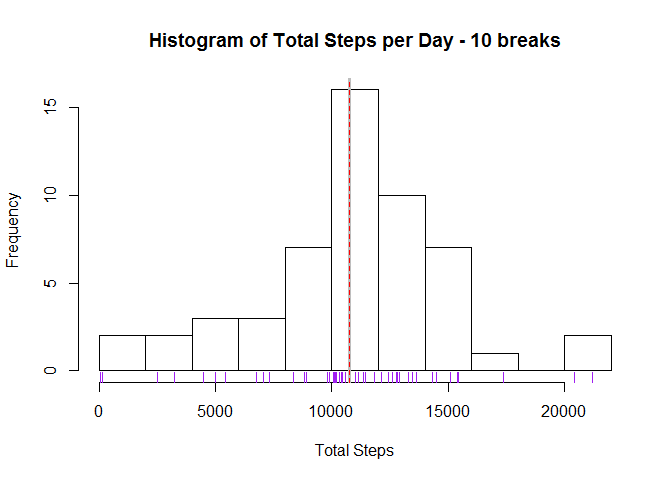
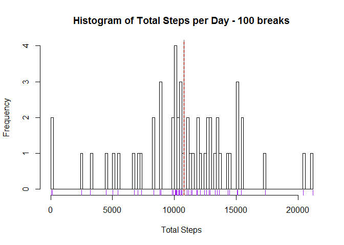
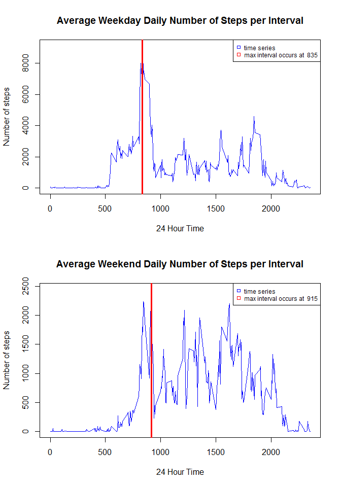

# Reproducible Research: Peer Assessment 1


## Loading and preprocessing the data

## R script for Reproducible Research Project 1 lot 1

```r
##setwd("C:/Coursera/Data_Science/Reproduce/Repro_prj1")
options(warn = -1)
library(dplyr)
```

```
## 
## Attaching package: 'dplyr'
## 
## The following object is masked from 'package:stats':
## 
##     filter
## 
## The following objects are masked from 'package:base':
## 
##     intersect, setdiff, setequal, union
```

```r
library(lubridate)
library(datasets)
library(downloader)
library(data.table)
```

```
## 
## Attaching package: 'data.table'
## 
## The following objects are masked from 'package:lubridate':
## 
##     hour, mday, month, quarter, wday, week, yday, year
## 
## The following objects are masked from 'package:dplyr':
## 
##     between, last
```

```r
library(ggplot2)
library(lattice)

fileUrl <- "https://d396qusza40orc.cloudfront.net/repdata/data/activity.zip?accessType=DOWNLOAD"
download(fileUrl, dest="activity.zip", mode="wb") 
unzip ("activity.zip")

dt_act <- fread("activity.csv")
df_act <- data.frame(dt_act)
df_act$date <- as.Date(df_act$date)


## Add date fields to summarise the data to look for patterns
df_act$wkday <- lubridate::wday(df_act$date, label = TRUE) ## create day of week field
df_act$day <- lubridate::yday(df_act$date)
```
## What is mean total number of steps taken per day?


```r
df_byday <- group_by(df_act, day)
##summarise(df_byday, sum(steps), mean(steps))
##summarise(filter(df_act, !is.na(steps)), sum(steps))
df_stepsbyday <- aggregate(steps ~ day, data = df_act, sum)
df_byinterval <- aggregate(steps ~ interval, data = df_act, sum)
df_byinterval_wend <- aggregate(steps ~ interval, data = filter(df_act, wkday == "Sun" | wkday == "Sat"), sum)
df_byinterval_wday <- aggregate(steps ~ interval, data = filter(df_act, wkday != "Sun" & wkday != "Sat"), sum)
df_avgbyinterval <- aggregate(steps ~ interval, data = df_act, mean)
df_avgbyinterval_wend <- aggregate(steps ~ interval, data = filter(df_act, wkday == "Sun" | wkday == "Sat"), mean)
df_avgbyinterval_wday <- aggregate(steps ~ interval, data = filter(df_act, wkday != "Sun" & wkday != "Sat"), mean)
mean_steps <- summarise(df_stepsbyday, mean(steps))
median_steps <- summarise(df_stepsbyday, median(steps))
```


The mean number of steps taken per day is 10766.

## What is the average daily activity pattern?

The daily activity can be shown in the following plot which shows the average number of steps per interval.  This plot illustrates what you could expect from the subject on any given day, not separating it out for weekend or weekday.


```r
maxsteps <- max(df_byinterval$steps)
maxinterval <- filter(df_byinterval, steps == maxsteps)[1,1]
maxsteps_wend <- max(df_byinterval_wend$steps)
maxinterval_wend <- filter(df_byinterval_wend, steps == maxsteps_wend)[1,1]
maxsteps_wday <- max(df_byinterval_wday$steps)
maxinterval_wday <- filter(df_byinterval_wday, steps == maxsteps_wday)[1,1]

plot(df_avgbyinterval$interval, df_avgbyinterval$steps, type = "l",
     main = "Average Daily Number of Steps per Interval",
     xlab = "24 Hour Time",
     ylab = "Number of steps",
     col = "blue")
```

 

```r
par(mfcol = c(3,1))
plot(df_avgbyinterval$interval, df_avgbyinterval$steps, type = "l",
     main = "Average Daily Number of Steps per Interval",
     xlab = "24 Hour Time - Total",
     ylab = "Number of steps",
     col = "blue")
plot(df_avgbyinterval_wend$interval, df_avgbyinterval_wend$steps, type = "l",
     xlab = "24 Hour Time - Weekend",
     ylab = "Number of steps",
     col = "red")
plot(df_avgbyinterval_wday$interval, df_avgbyinterval_wday$steps, type = "l",
     xlab = "24 Hour Time - Weekday",
     ylab = "Number of steps",
     col = "green")
```

 

```r
##abline(v=maxinterval, col = "red", lwd = 3, lty = 1)
##legend("topright", pch = 0, col = c("blue", "red"), cex = .75, legend = c("time series", paste("max interval occurs at ", maxinterval)))
```

The 5 minute interva with the highest average number of steps is 835.

Below is the code and histograms showing the total number of steps taken each day.  Two plots are provided showing both 10 and 100 breaks.  

##average steps per day

```r
hist(df_stepsbyday$steps, breaks = 10, main = "Histogram of Total Steps per Day - 10 breaks",
     xlab = "Total Steps")
rug(df_stepsbyday$steps, col = "purple")
abline(v=mean_steps, col = "grey", lwd = 3, lty = 1)
abline(v=median_steps, col = "red", lwd = 1, lty = 2)
```

 

```r
hist(df_stepsbyday$steps, breaks = 100, main = "Histogram of Total Steps per Day - 100 breaks",
     xlab = "Total Steps")
rug(df_stepsbyday$steps, col = "purple")
abline(v=mean_steps, col = "grey", lwd = 3, lty = 1)
abline(v=median_steps, col = "red", lwd = 1, lty = 2)
```

 

## Imputing missing values

Below is my strategy for imputting missing values.  I created an avg steps for each interval and merged this with the original data frame. Where the original steps for a specific interval was NA, I replaced its value with the average for the segment.


```r
good <- complete.cases(df_act)
sum(good)
```

```
## [1] 15264
```

```r
bad <- sum(!complete.cases(df_act))
```

The total number of missing values "NA" values in the orginal data frame is 2304.  Other details of the dataset can be seen in the following summary.


```r
summary(df_act)
```

```
##      steps             date               interval        wkday     
##  Min.   :  0.00   Min.   :2012-10-01   Min.   :   0.0   Sun  :2304  
##  1st Qu.:  0.00   1st Qu.:2012-10-16   1st Qu.: 588.8   Mon  :2592  
##  Median :  0.00   Median :2012-10-31   Median :1177.5   Tues :2592  
##  Mean   : 37.38   Mean   :2012-10-31   Mean   :1177.5   Wed  :2592  
##  3rd Qu.: 12.00   3rd Qu.:2012-11-15   3rd Qu.:1766.2   Thurs:2592  
##  Max.   :806.00   Max.   :2012-11-30   Max.   :2355.0   Fri  :2592  
##  NA's   :2304                                           Sat  :2304  
##       day     
##  Min.   :275  
##  1st Qu.:290  
##  Median :305  
##  Mean   :305  
##  3rd Qu.:320  
##  Max.   :335  
## 
```


```r
df_good <- merge(df_act, df_avgbyinterval, by.x = "interval", by.y = "interval")
df_good <- arrange(df_good, date)
##replace(df_good$steps.x, !complete.cases(df_act), df_good$steps.y)
for (z in df_good){
  xsteps <- df_good$steps.x[z]
  ysteps <- df_good$steps.y[z]
  if(is.na(xsteps)){
    df_good$steps.x <- df_good$steps.y
  }
}

good2 <- complete.cases(df_good)
sum(good2)
```

```
## [1] 17568
```

```r
bad2 <- sum(!complete.cases(df_good))
```

The total number of missing values "NA" values in the imputted data frame is 0.  Other details of the dataset can be seen in the following summary.


```r
summary(df_good)
```

```
##     interval         steps.x             date              wkday     
##  Min.   :   0.0   Min.   :  0.000   Min.   :2012-10-01   Sun  :2304  
##  1st Qu.: 588.8   1st Qu.:  2.486   1st Qu.:2012-10-16   Mon  :2592  
##  Median :1177.5   Median : 34.113   Median :2012-10-31   Tues :2592  
##  Mean   :1177.5   Mean   : 37.383   Mean   :2012-10-31   Wed  :2592  
##  3rd Qu.:1766.2   3rd Qu.: 52.835   3rd Qu.:2012-11-15   Thurs:2592  
##  Max.   :2355.0   Max.   :206.170   Max.   :2012-11-30   Fri  :2592  
##                                                          Sat  :2304  
##       day         steps.y       
##  Min.   :275   Min.   :  0.000  
##  1st Qu.:290   1st Qu.:  2.486  
##  Median :305   Median : 34.113  
##  Mean   :305   Mean   : 37.383  
##  3rd Qu.:320   3rd Qu.: 52.835  
##  Max.   :335   Max.   :206.170  
## 
```

## Are there differences in activity patterns between weekdays and weekends?

There are differences in the activity patterns between weekdays and weekends as illustrated by the following charts.


```r
par(mfcol = c(2,1))
  plot(df_byinterval_wday$interval, df_byinterval_wday$steps, type = "l",
      main = "Average Weekday Daily Number of Steps per Interval",
      xlab = "24 Hour Time",
      ylab = "Number of steps",
      col = "blue")
     abline(v=maxinterval_wday, col = "red", lwd = 3, lty = 1)
     legend("topright", pch = 0, col = c("blue", "red"), cex = .75, legend = c("time series", paste("max interval occurs at ", maxinterval_wday)))
  plot(df_byinterval_wend$interval, df_byinterval_wend$steps, type = "l",
     main = "Average Weekend Daily Number of Steps per Interval",
     xlab = "24 Hour Time",
     ylab = "Number of steps",
     col = "blue")
    abline(v=maxinterval_wend, col = "red", lwd = 3, lty = 1)
    legend("topright", pch = 0, col = c("blue", "red"), cex = .75, legend = c("time series", paste("max interval occurs at ", maxinterval_wend)))
```

 

```r
options(warn = 0)
```


```r
df_act$weekfact <- as.character(df_act$wkday)

## Loop to update the values in weekfact using replace then convert to factor column

unique_days <- as.character(unique(df_act$wkday))
for(i in unique_days){
  if(identical(i,"Sat")){
    index <- df_act$wkday == i
    df_act$weekfact <- replace(df_act$weekfact, index, "weekend") 
  } else if(identical(i,"Sun")){
    index <- df_act$wkday == i
    df_act$weekfact <- replace(df_act$weekfact, index, "weekend")
  } else{
    index <- df_act$wkday == i
    df_act$weekfact <- replace(df_act$weekfact, index, "weekday")
  }
}

df_act$weekfact <- as.factor(df_act$weekfact)
```

Below shows that the weekfact column is now a factor variable


```r
str(df_act)
```

```
## 'data.frame':	17568 obs. of  6 variables:
##  $ steps   : int  NA NA NA NA NA NA NA NA NA NA ...
##  $ date    : Date, format: "2012-10-01" "2012-10-01" ...
##  $ interval: int  0 5 10 15 20 25 30 35 40 45 ...
##  $ wkday   : Ord.factor w/ 7 levels "Sun"<"Mon"<"Tues"<..: 2 2 2 2 2 2 2 2 2 2 ...
##  $ day     : num  275 275 275 275 275 275 275 275 275 275 ...
##  $ weekfact: Factor w/ 2 levels "weekday","weekend": 1 1 1 1 1 1 1 1 1 1 ...
```


```r
df_avgbyfactor <- aggregate(steps ~ interval + weekfact, data = df_act, mean)
xyplot(steps~interval|weekfact, data = df_avgbyfactor, type = "l", layout = c(1,2))
```

 

